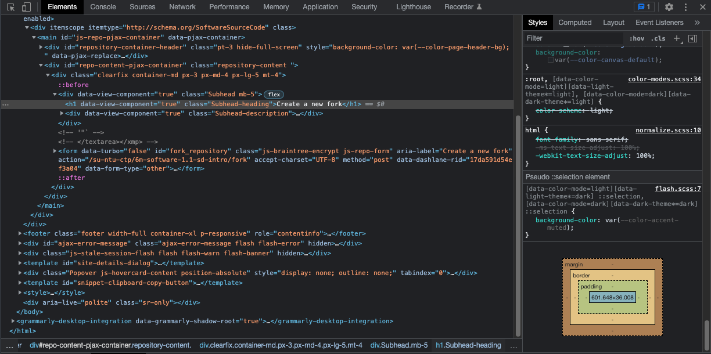

## Brief

### Lesson Overview

This lesson contains a lot of installations. Learners should expect hiccups and some waiting time while instructor is troubleshooting issues for other learners.

## Self studies check-in

1. What are programming languages? Why do we have to use them?
2. What is the difference between compiler, transpiler and interpreter?
3. What is a software development environment? (bridging to lesson)

---

## Part 1 - Bash for Win & Explore Bash Commands

Demonstrate to students what bash commands can do by referring to this [cheatsheet](https://www.educative.io/blog/bash-shell-command-cheat-sheet). Attempt the following Shell Commands in 5 mins as part of demo:

```sh
mkdir test-folder # create new folder
pwd # print working directory (current directory)
cd test-folder # change directory to 'test-folder'
pwd # print current directory and observe the difference
touch a.txt # create a new file
touch b.txt # create a new file
ls # list all files in current directory
```

Now, let Windows Learners install their Bash Shell for Windows and MacOS Learners to play around with the cheat sheet.

---

## Part 2 - Install NVM & Latest Node LTS

- Install NVM in the respective Operating Systems.
- Install node and npm using the `nvm` command.

Example:
```sh
nvm ls-remote # list all versions
nvm install v18.12.0 # install latest LTS
nvm alias default # ensure v18.12.0 is printed
```

---

## Part 3 - Installing & Basic GIT Commands

Upon successful installation, hitting `git --version` on Terminal should display the version number.

> Learners will go through the full lesson on GIT in the next lesson.

It is good for learners to decide on a directory in their laptops where they would clone all repositories into. 

Suggestion:

MacOS: `~/sctp`
Windows: `C:\Users\<your username>\sctp`

---

## Part 4 - VS Code

- Install VS Code
- Git Clone
    - To clone the current lesson repository, run the following command on Terminal:
    ```sh
    git clone https://github.com/su-ntu-ctp/6m-software-1.1-sd-intro
    ```
    - To launch the cloned folder on VS Code, run the following commands on Terminal (exclude # and the words behind. Those are comments): 
    ```sh
    cd 6m-software-1.1-sd-intro
    code .
    ```
    - With explanation in comments:
    ```sh
    cd 6m-software-1.1-sd-intro # change directory to the specified folder
    code . # launch current directory on code
    ```
- Install Extensions on VS Code
    - Live Share (pair programming - good for seeking help from instructors)
        - Instructor create a read-only link and share with students.
        - Be sure to show students there are read-only and write permissible links.
    - Live Server (to host html)
        - This is being used in module 1 only (2 weeks).
        - In the explorer navigation on the left
            1. expand `src` folder
            1. right-click `index.html`
            1. choose "Open with live server"
            1. you should see a page on browser 
    - Prettier code formatter
        - Use [index.js](./src/index.js) as example by opening the file.
        - Right-click the code and choose "Format Document with"
        - Select Prettier
---

## Part 5 - Chrome Developer's Tool

The Chrome developer's tool can be accessed by doing either of the following:
1. Right-click on the screen and choose "Inspect"
2. Pressing F12 or Ctrl+Shift+I in the keyboard

Walk learners through the `elements` and `console` tab.



## Part 6 - Self studies briefing

There are self studies materials in every lesson's repository. Navigate to the file `studies.md` to view self studies material.
