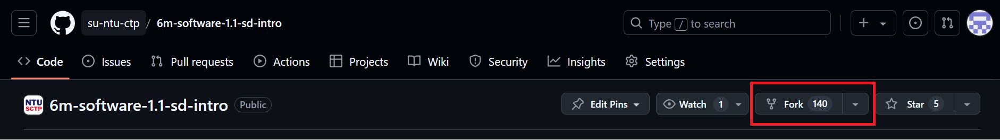
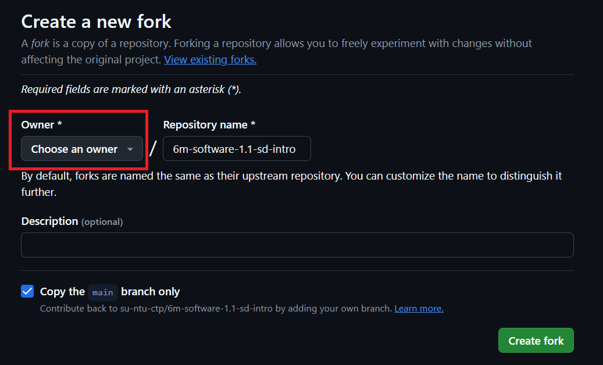

## Brief

### Lesson Overview

This lesson contains a lot of installations. Learners should expect hiccups and some waiting time while instructor is troubleshooting issues for other learners.

## Self studies check-in

1. What are programming languages? Why do we have to use them?
2. What is the difference between compiler, and interpreter?
3. What is a software development environment? (bridging to lesson)

---

## Part 1 - Bash for Win & Explore Bash Commands

The command line, also known as the **terminal**, is a text-based computer interface. We will use the command line to manage files, use Git version control, and run Node applications. Using the command line is separate from writing application code, though we will need the command line to build apps effectively.

### Demonstration

Students can check what bash commands can do by referring to this [cheatsheet](https://www.educative.io/blog/bash-shell-command-cheat-sheet). Attempt the following Shell Commands in 5 mins as part of demo:

```sh
mkdir test-folder # create new folder
pwd # print working directory (current directory)
cd test-folder # change directory to 'test-folder'
pwd # print current directory and observe the difference
touch a.txt # create a new file
touch b.txt # create a new file
ls # list all files in current directory
```

Now, let Windows Learners install their Bash Shell or use Windows Powershell for Windows and MacOS Learners to play around with the cheat sheet.

*Note: there is no ```**touch**``` command in Windows Powershell. Windows users can try using the **```ni``` (new item)** command to make files.*

---

## Part 2 - Install NVM & Latest Node LTS

Node Version Manager (NVM), as the name implies, is a tool for managing Node versions on your device.

### Installation of NVM

- Install NVM in the respective Operating Systems (please see the studies.md file for the installation links).

### Installation of Node

- Install Node using the `nvm` command.

Example:
```sh
nvm ls-remote # list all versions
nvm install v18.18.0 # install latest LTS
nvm alias default # ensure v18.18.0 is printed
```
---

## Part 3 - VSCode

VSCode is one of the most popular code editors in the world. It offers a robust library of extensions and features to provide developers with an environment not only to write code but to perform tasks related to development.

- Download and install VSCode [here](https://code.visualstudio.com/download)
- Install the following extensions on VSCode
    - Live Share (pair programming - good for seeking help from instructors)
        - The instructor can create a read-only link and share with students.
        - Be sure to show students there are read-only and write permissible links.
    - Live Server (to host html)
        - Note: This is going to be used in Module 1 only.
        - We will be doing this after we have forked and cloned the repository
        - In the explorer navigation on the left
            1. expand `src` folder
            1. right-click `index.html`
            1. choose "Open with live server"
            1. you should see a page on browser 
    - Prettier code formatter
        - We will use [index.js](./src/index.js) as an example after cloning the repo.
        - Right-click the code and choose "Format Document with"
        - Select Prettier

---

## Part 4 - Installing Git, Forking, and Cloning Repos

All software engineers use version control to manage and review project versions and to write code in teams. Version control allows us to track which versions of our code have which features, and to write code in teams while avoiding potential conflicts. Git is the most popular version control system.

### Installation

Go to the Git downloads [page](https://git-scm.com/downloads) and follow the instructions based on the OS that you have.
 
Upon successful installation, hitting `git --version` on Terminal should display the version number.

> Learners will go through the full lesson on Git in the next lesson.

It is good for learners to decide on a directory in their macines where they would clone all repositories into. 

Suggestion:

MacOS: `~/sctp`
Windows: `C:\Users\<your username>\sctp`

### Forking and Cloning

- Forking the repo (copying a repo)
    - Go to Github, and fork this [directory](https://github.com/su-ntu-ctp/6m-software-1.1-sd-intro) by clicking on the "Fork" button
    
    - Make sure you select your Github account as the owner of the forked repo, then click on "Create Fork"
    
    - You should be able to see that the forked repository is under your Github account
- Git clone
    - To clone the current lesson repository, run the following command on Terminal:
    ```sh
    git clone https://github.com/<your-github-account>/6m-software-1.1-sd-intro
    ```
    - To launch the cloned folder on VS Code, run the following commands on Terminal (exclude # and the words behind. Those are comments): 
    ```sh
    cd 6m-software-1.1-sd-intro
    code .
    ```
    - With explanation in comments:
    ```sh
    cd 6m-software-1.1-sd-intro # change directory to the specified folder
    code . # launch current directory on code
    ```
---

## Part 5 - Chrome Developer Tools

The Chrome developer tools can be accessed by doing either of the following:
1. Right-click on the screen and choose "Inspect"
2. Pressing F12 in the keyboard
3. Pressing Ctrl+Shift+I in the keyboard

Check out the `elements` and `console` tab.


## Part 6 - Self studies briefing

There are self studies materials in every lesson's repository. Navigate to the file `studies.md` to view self studies material.

## Part 7 - Assignment briefing

Each lesson has its own assignment for you to supplement your learnings about the lesson. You can find the instructions to the assignment in the `assignment.md` file. Submission is done in NTU Blackboard, provide the link to your Github repository for the submission.
